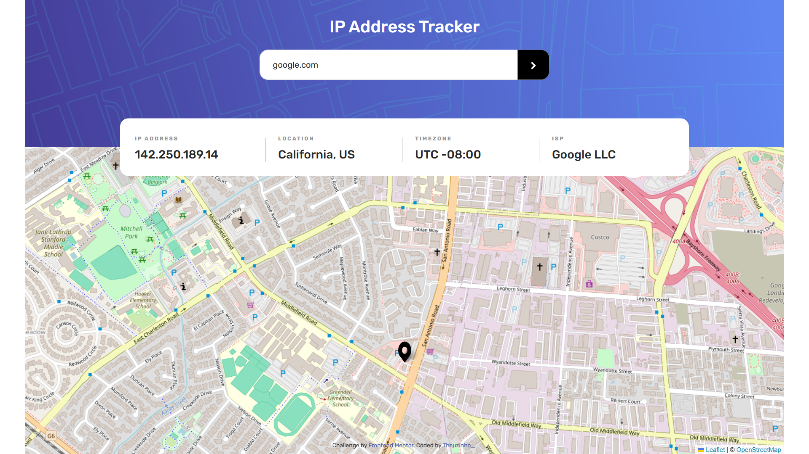

# Frontend Mentor - IP address tracker solution

This is a solution to the [IP address tracker challenge on Frontend Mentor](https://www.frontendmentor.io/challenges/ip-address-tracker-I8-0yYAH0). Frontend Mentor challenges help you improve your coding skills by building realistic projects. 

## Table of contents

- [Overview](#overview)
  - [The challenge](#the-challenge)
  - [Screenshot](#screenshot)
  - [Links](#links)
- [My process](#my-process)
  - [Built with](#built-with)
  - [What I learned](#what-i-learned)
  - [Continued development](#continued-development)
  - [Useful resources](#useful-resources)
- [Author](#author)

## Overview

### The challenge

Users should be able to:

- View the optimal layout for each page depending on their device's screen size
- See hover states for all interactive elements on the page
- See their own IP address on the map on the initial page load
- Search for any IP addresses or domains and see the key information and location

### Screenshot



### Links

- Solution URL: [Add solution URL here](https://your-solution-url.com)
- Live Site URL: [Add live site URL here](https://your-live-site-url.com)

## My process

### Built with

- Semantic HTML5 markup
- CSS custom properties
- Mobile-first workflow
- [Bootstrap](https://getbootstrap.com/) - css framework
- [Sass](https://sass-lang.com/) - css framework
- [Jquery](https://jquery.com/) - js framework

### What I learned
I learned how to use the sass framework, create mixins and implement them in my project:

```scss
@mixin after-border {
  content: "";
  display: block;
  width: 1px;
  position: absolute;
  top: 0;
  right: 0;
  background-color: variables.$dark-gray;
}

%after-border {
  position: relative;

  &::after {
    @include after-border;
  }
}
```

I improved my knowledge of jquery, learning how to make requests in jquery and using the response on my page:d
```js
  $.ajax({
    url,
    type: "GET",
    typeData: "json",
    success: (data) => {
      showInfo(data);
      showMap(data.location.lat, data.location.lng);
    },
    error: (error) => {
      const erro = error.responseJSON.messages
      const message = `solictação falhou: ${erro}`;

      showAlert(message);
      searchLocation();
    },
  });
```

### Continued development

I will continue to improve my skills in Bootstrap, a great help for website styling. I will learn more about jQuery and maybe new things like Vue.js. I will improve my knowledge of APIs and HTTP requests and finally I will continue to learn more about JavaScript and its frameworks.

### Useful resources

- [Stack Overflow](https://stackoverflow.com/) - It helped me a lot with most of my doubts about jquery.

## Author

- Frontend Mentor - [@Theuz1nh0](https://www.frontendmentor.io/profile/Theuz1nh0)
- Linkedin - [@theuz1nh0](https://www.linkedin.com/in/theuz1nh0/)
